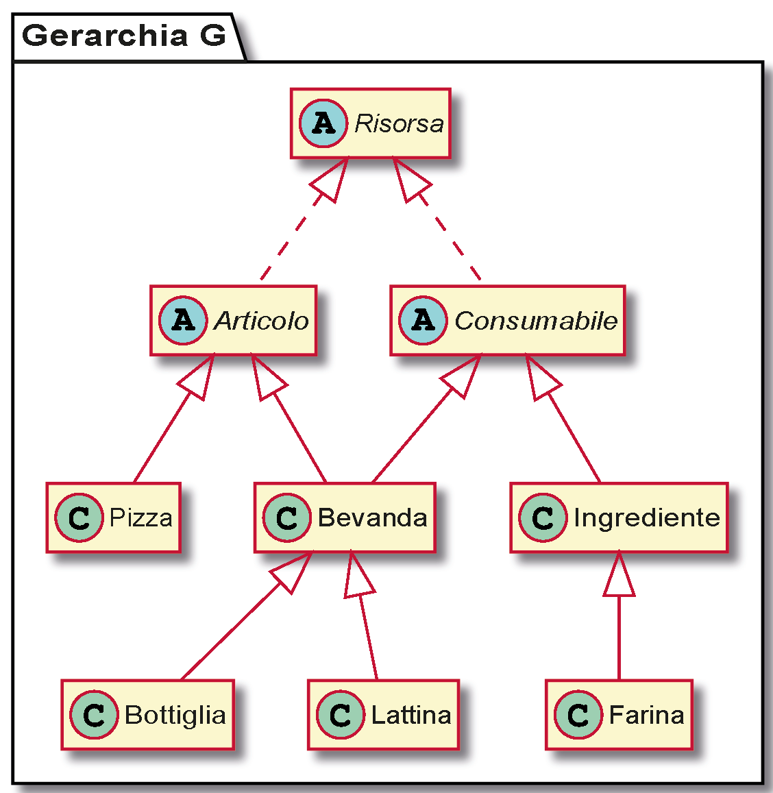

{ width=50% }
 \newline \newline { width=75% }

\newpage

# Abstract e Funzionalità

Lo scopo del progetto è fornire un applicativo per informatizzare una pizzeria da asporto ecologica e orientata ai prodotti locali, implementando una gestione efficiente di inventario, menu e comande.

L'applicativo fornisce all'utente le seguenti funzionalità:

- Inserimento, rimozione e modifica di un articolo dal menù
- Inserimento, rimozione e modifica (in modo _smart_) di un ingrediente dall'inventario.
- Inserimento, rimozione e modifica (in modo _smart_) di una comanda da una bacheca apposita.
- Una funzionalità di _contabilizzazione_ per calcolare il guadagno/perdita della pizzeria in un determinato periodo di tempo.
- Una funzionalità di salvataggio e caricamento di tutti i dati del programma.

# Progettazione e descrizione delle gerarchie utilizzate

## Gerarchia G

{ width=60% }

- `Risorsa`: Base astratta della gerarchia, rappresenta ad alto livello ogni elemento gestito dalla pizzeria. Contiene informazioni generiche di ogni oggetto (ID, nome, disponibilità) e definisce dei metodi virtuali puri da implementare nelle sottoclassi concrete.

- `Articolo`: Sottotipo astratto derivante da `Risorsa`, le cui istanze rappresentano i prodotti venduti dalla pizzeria. Aggiunge l'informazione relativa al prezzo iniziale di ogni articolo venduto e due metodi virtuali puri che ritornano rispettivamente il prezzo e la composizione di ogni articolo.

- `Consumabile`: Sottotipo astratto derivante da `Risorsa`, rappresenta gli oggetti di consumo usati dalla pizzeria per preparare gli articoli da vendere. Aggiunge i campi dati quantità acquistata, costo e data d'acquisto necessari per il calcolo della contabilizzazione e un metodo virtuale puro che ritorna la spesa sostenuta dalla pizzeria per acquistare un consumabile

- `Pizza`: Sottotipo concreto derivante da `Articolo`, le cui istanze rappresentano le pizze presenti nel menu della pizzeria. Implementa i metodi virtuali ereditati da `Articolo` per calcolare il prezzo d'acquisto e la lista di ingredienti usati nella pizza. 

- `Bevanda`: Sottotipo concreto derivante da `Articolo` e `Consumabile`, che implementa i metodi virtuali puri di entrambe le superclassi.

- `Ingrediente`: Sottotipo concreto derivante da `Consumabile`, le cui istanze rappresentano gli ingredienti usati dalla pizzeria per creare le pizze. Aggiunge il booleano _locale_, che indica la provenienza dell'ingrediente (gli ingredienti locali hanno un costo d'acquisto maggiore, che si riflette in un prezzo più alto per gli articoli che lo usano). Implementa il metodo virtuale ereditato da `Consumabile` per calcolare il costo d'acquisto.

- `Bottiglia`, `Lattina`: Sottotipi concreti derivanti da `Bevanda`, le cui istanze rappresentano un tipo particolare di bevanda (indicato dal nome della classe). Si è scelto di differenziare in questo modo i diversi tipi di bevanda per aumentare l'estensibilità del modello, in quanto per aggiungere nuove tipologie di bevanda è sufficiente estendere la classe `Bevanda`.

- `Farina`: Sottotipo concreto derivante da `Ingrediente`, le cui istanze rappresentano le diverse farine usate dalla pizzeria per preparare le pizze. In quanto particolare tipo di ingrediente non implementa i metodi virtuali ereditati da `Consumabile` ma sfrutta le implementazioni della superclasse. Si è scelto di differenziare in questo modo i diversi tipi di farina per aumentare l'estensibilità del modello, in quanto per aggiungere nuove farine è sufficiente creare nuove istanze di questa classe.

## Ulteriori classi del modello

Oltre alla gerarchia _G_ sono state sviluppate delle classi di supporto, il cui scopo è implementare delle funzionalità necessarie per realizzare la _business logic_ del programma, mantenendo modularità e estensibilità.

- `Contatto`: Classe che modella le informazioni di un cliente che effettua un'ordinazione. Contiene i dati relativi a nome, indirizzo di consegna e numero di telefono.

- `Comanda`: Classe che modella una comanda effettuata dal cliente della pizzeria. Ogni comanda contiene un'istanza di `Contatto`, ora e data di consegna, il contenuto dell'ordinazione (modellato tramite una `std::unordered_map`) e il costo totale dell'ordinazione.

- `GestoreComande`: Classe che modella la gestione delle comande all'interno della pizzeria. Contiene un _contenitore_ di `Comande` ordinate temporalmente in base all'ora di consegna delle stesse. Fornisce metodi di rimozione, modifica, ricerca e un metodo di inserimento che calcola il primo slot temporale in cui sia possibile effettuare la comanda da inserire, e ne modifica l'ora di consegna se quella indicata nella comanda non sia valida o soddisfacibile.

- `GestoreRisorse`: Classe che modella la gestione di menù e inventario tramite due _contenitori_ istanziati rispettivamente a `Articolo*` e `Consumabile*`. Fornisce metodi di ricerca, inserimento, rimozione e modifica _smart_, ovvero che mantengono la coerenza tra gli oggetti memorizzati (es: rimuovendo un ingrediente dall'inventario tutti gli articoli che usano quell'ingrediente diventano non disponibili).

- `Pizzeria`: Interfaccia pubblica del modello, usata per rendere disponibili le funzionalità del progetto a componenti esterni (es: controller) nascondendone l'implementazione.

## Contenitore 

Il contenitore di oggetti polimorfi è stato implementanto come _double linked-list_ templatizzata, con relativi iteratori bidirezionali, metodi di inserimento e rimozione, operatori di confronto e funzioni di ricerca e conteggio. Si è scelto di implementare una lista perché nei casi d'uso dell'applicazione si è ritenuto più vantaggioso l'inserimento in una posizione arbitraria in tempo costante rispetto all'accesso agli elementi in tempo costante (ottenibile tramite un vettore). 

## GUI

L'interfaccia grafica dell'applicazione è composta dalla finestra principale (classe `MainWindow`) che funge da contenitore per un header con logo e orologio (classe `header`) e per i quattro widget principali (_menu_, _comande_, _inventario_, _contabilizzazione_), visualizzabili selezionando l'etichetta corrispondente.
Da ogni widget è possibile visualizzare, modificare, inserire e rimuovere i corrispondenti oggetti del modello. 

La comunicazione da e verso il modello è gestita tramite il meccanismo di _segnali/slot_ del framework Qt: i segnali provenienti dai vari widget sono inviati ai relativi slot del _Controller_ (classe `Controller`), che si occuperà di invocare le adeguate funzioni del modello per modificare i dati e successivamente della vista per aggiornarne lo stato.
Dato il quantitativo e la complessità dei dati da inviare/ricevere si è implementata una gerarchia di `struct` (file `pacchetti.h`), che rispecchia la struttura della gerarchia _G_ e permette la comunicazione tra componenti dell'architettura senza rivelare l'implementazione del modello.

## Indipendenza e riusabilità del modello

L'applicazione è stata realizzata usando il pattern MVC (Model-View-Controller) in modo da separare la parte logica dalla GUI e rendere il modello quanto più possibile indipendente dalla GUI sviluppata.
Il modello non è tuttavia indipendente dal framework, in quanto si è scelto di usare alcune classi della libreria Qt (`QTime`, `QDate`, `QJson..`) per praticità e per evitare di impiegare ore di sviluppo per implementare delle classi equivalenti per la gestione di date, orari e I/O.

# Chiamate Polimorfe

- `clone()`: Metodo virtuale puro della classe `Risorsa`; effettua una copia dell'oggetto di invocazione e ritorna un puntatore al nuovo oggetto creato.'

- `salva()`: Metodo virtuale puro della classe `Risorsa`; effettua la _serializzazione_ dell'oggetto di invocazione in un oggetto JSON, ricevuto come parametro, che verrà salvato su file.

- `carica()`: Metodo virtuale puro della classe `Risorsa`; effettua la _deserializzazione_ dell'oggetto di invocazione, assegnando ai campi dati propri dell'oggetto i corrispondenti valori dell'oggetto JSON, ricevuto come parametro, proveniente da file.

- `modifica()`: Metodo virtuale puro della classe `Risorsa`; effettua la modifica dei campi dati dell'oggetto di invocazione in modo polimorfo, estraendo i nuovi valori dall'oggetto ricevuto come parametro.

- `getComposizione()`: Metodo virtuale puro della classe `Articolo`; restituisce una lista di oggetti di tipo `Consumabile` che rappresentano  gli ingredienti presenti nell'articolo di invocazione. 

- `getPrezzo()`: Metodo virtuale puro della classe `Articolo`; restituisce il prezzo di vendita di un articolo (calcolato in modo differente per ogni sottotipo di `Articolo`).

- `getSpesa()`: Metodo virtuale puro della classe `Consumabile`; restituisce la spesa sostenuta dalla pizzeria per l'acquisto dell'oggetto di invocazione (calcolato in modo differente per ogni sottotipo di `Consumabile`).

- `rendiEditabile()`: Metodo virtuale puro appartenente alla classe `TabellaComposita`; abilita/disabilita la modifica dei dati contenuti nelle tabelle usate nel programma e aggiunge i _widget_ opportuni (diversi per ogni sottotipo di `TabellaComposita`) per permettere la modifica/eliminazione dei dati presenti nella tabella.

# I/O

Il programma permette caricamento e salvataggio dei dati su file in formato JSON. È stato scelto il formato JSON in quanto:

- Ha una sintassi semplice e leggibile
- È notevolmente meno verboso rispetto al formato XML. 
- Supporta nativamente il caricamento e salvataggio delle mappe non ordinate, che sono state usate in modo estensivo nel modello dell'applicazione

Per implementare tali funzionalità sono state usate le apposite classi della libreria Qt (`QJsonDocument`, `QJsonObject` ecc).

Al fine di aumentare l'estensibilità del codice invece di implementare un'unica funzione di salvataggio/caricamento nell'interfaccia pubblica del modello si è deciso di fornire a ogni classe i metodi `carica()` e `salva()`, che hanno rispettivamente il compito di inizializzare i campi dati dell'oggetto di invocazione con i valori presenti nel file (_deserializzazione_) e di salvare i valori dei campi dati dell'oggetto di invocazione su file (serializzazione). Con questa implementazione il progettista che vorrà estendere la gerarchia dovrà solamente fornire l'implementazione di questi metodi per fornire la funzionalità di I/O alle classi da lui aggiunte. 

Il caricamento delle risorse avviene in automatico ad ogni apertura del programma attraverso il metodo `caricaRisorse()`.
Il salvataggio è manuale e a discrezione dell'utente; tuttavia se si tentasse di chiudere l'applicazione e delle informazioni non fossero salvate, verrà chiesto all'utente se si desidera procedere al salvataggio prima della chiusura. È inoltre possibile salvare manualmente i dati del programma selezionando l'opzione "Inventario e Menu" all'interno della sezione "Salva" nella barra dei menu.

È inoltre possibile modificare manualmente il contenuto dei file JSON: tuttavia questo metodo è fortemente sconsigliato in quanto un errore di sintassi nel file provocherebbe un errato caricamento dei dati.

Nel file `risorse.json` vengono salvati gli oggetti della gerarchia _G_ opportunamente divisi tra menù e inventario, mentre nel file `comande.json` vengono progressivamente salvate le ordinazioni effettuate dai clienti della pizzeria.

# Suddivisione dei compiti - Ore di sviluppo 

Mi sono occupato dell'implementazione dell'intera funzionalità di I/O e di alcune parti di modello, controller e _backend_ tra i widget (sia principali che secondari) e il controller.
Gabriel si è occupato dell'implementazione di tutti i Wizard e di alcune parti di modello, controller e dei widget principali della vista.
Andrea si è occupato della progettazione e realizzazione dell'aspetto grafico della vista (incluso il foglio CSS) e di alcune parti di modello, controller e dei widget secondari della vista.

È doveroso precisare che la suddivisione dei compiti appena esposta è approssimativa, in quanto la fase di sviluppo è stata integrata da _meeting_ Zoom giornalieri in cui si è discusso l'andamento della codifica di ogni componente e la risoluzione di eventuali criticità riscontrate. Sebbene questa metodologia di sviluppo sia risultata più lenta rispetto a una strategia _divide-et-impera_, ci ha permesso di completare più velocemente le singole componenti, riducendo così la necessita di effettuare test di integrazione e focalizzando la ricerca in itinere di eventuali bug al singolo componente in sviluppo.  

Lo sviluppo del progetto ha richiesto approssimativamente 60 ore di lavoro individuale così suddivise:

- Analisi preliminare dei requisiti: 2 ore
- Progettazione modello: 2 ore
- Progettazione GUI: 3 ore 
- Apprendimento libreria Qt: 4 ore + 7 ore tutorato
- Codifica modello: 10 ore
- Codifica GUI: 20 ore
- Debugging e testing: 10 ore
- Stesura relazione: 2 ore

Il superamento del monte ore individuale è stato causato dall'apprendimento della libreria Qt e dalla risoluzione di alcuni bug difficili da identificare all'interno del _qontainer_. 

# Manuale Utente

L'applicazione fornisce una GUI intuitiva e completa che non necessita di un manuale d'uso.
L'aggiunta di un nuovo articolo/comanda/consumabile è gestita attraverso appositi wizard, spiegano pagina per pagina quali informazioni sono richieste e avvertono l'utente in caso di valori non validi.
Modifica e rimozione sono gestiti tramite i pulsanti "_Modifica_" dei widget di menù e inventario, la cui pressione rende editabili le tabelle dei rispettivi widget permettendo la modifica delle celle. Al termine della modifica sarà sufficiente premere il pulsante "_Finisci di modificare_".
**NB:** Per mantenere il modello in uno stato consistente l'aggiunta/modifica/rimozione delle bevande è consentita solo attraverso il widget "_Inventario_". Tramite il widget menù è possibile modificare la disponibilità delle bevande. 

# Istruzioni di compilazione

Il progetto è stato sviluppato utilizzando alcune funzionalità di C++11 (`auto`, `nullptr` e `to_string`). Per questo motivo è stato necessario modificare il file .pro aggiungendo la direttiva "`CONFIG += c+11`".

Per compilare ed eseguire il programma sono quindi necessari i seguenti comandi (si suppone che il terminale sia aperto nella cartella del progetto):

1. `qmake bellaPadova.pro`
2. `make`
3. `./bellaPadova`

# Ambiente di sviluppo

Il progetto è stato sviluppato in un'ambiente così configurato:

- **Sistema Operativo:** Microsoft Windows 10 Pro N 64bit (ver 1903)
- **Compilatore:** MinGW 5.3.0 32bit
- **Qt** ver 5.9.5

Modello e container sono stati sviluppati utilizzando l'IDE Visual Studio Code, poiché la maggior familiarità con esso ha permesso di eliminare il tempo di adattamento a un nuovo IDE. Successivamente il progetto è stato migrato a QtCreator in quanto la continua configurazione manuale (scrittura del _makefile_, _linking_ delle librerie Qt) è stata ritenuta ingestibile.

La fase di testing/debugging è stata svolta simultaneamente in ambienti Windows e Linux (quest'ultimo in particolare per la ricerca di _memory leak_ tramite _Valgrind_).